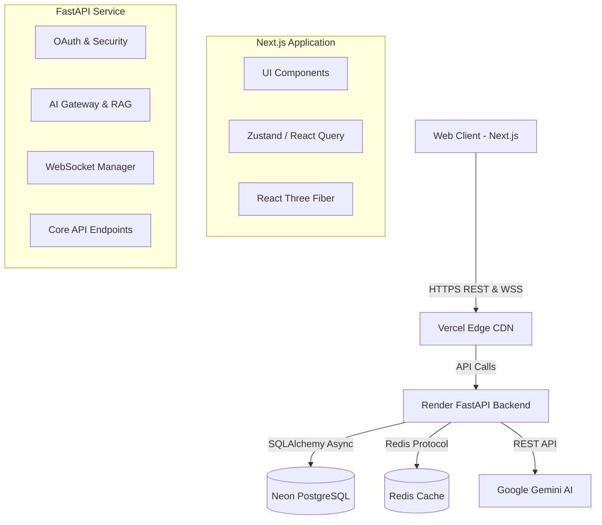
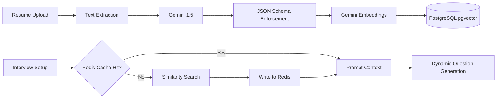

# 🚀 InterviewOS

<div align="center">
  
  
  
  
  
</div>

<br />

> **The AI Operating System for Interview Success and Technical Recruitment.**

**InterviewOS** is a production-grade SaaS platform acting as a central Intelligence Core. It helps candidates master interviews through AI-powered mock interviews, coding challenges, resume intelligence, and real-time coaching, while providing recruiters with deep analytics and candidate evaluation pipelines.

---

## ✨ Features (v1.0)

- 🔐 **Google Nexus Authentication**: End-to-end secure OAuth pipeline handling real user sessions and PostgreSQL database sync.
- 🎨 **The Command Center**: A futuristic, glassmorphic UI system built with Tailwind CSS v4, Framer Motion, and CSS backdrops.
- 📄 **Resume Intelligence Lab**: Advanced drag-and-drop resume scanner interface built for AI metadata extraction, scoring, and matching.
- 🧠 **AI Core Neural Sphere**: A highly optimized, interactive 3D WebGL neural sphere built on React Three Fiber running seamlessly in the background.
- 💻 **Algorithmic Coding Arena**: Collaborative, real-time code editor built on Monaco. Features **0ms latency WebSockets** and an OS-level **sandboxed execution environment**.
- 📊 **Recruiter Dashboard**: Complete pipeline management, organizational charting, and candidate analytics.
- ⚡ **High Performance**: Native Redis caching for vector embeddings and pgvector lookups, bypassing the database for lightning-fast AI inferences.

---

## 🛠️ Tech Stack

| Layer | Technology |
|-------|-----------|
| **Frontend** | Next.js 16 (App Router), React 19, TypeScript, Tailwind CSS v4 |
| **3D Graphics** | Three.js, React Three Fiber, Drei |
| **State Management** | Zustand (Persisted Storage), TanStack Query |
| **Backend** | FastAPI, SQLAlchemy 2.0 (async), Alembic, Pydantic |
| **Real-time** | WebSockets (FastAPI + React Native WebSocket Client) |
| **Database** | Neon PostgreSQL (Serverless) + pgvector |
| **Caching** | Redis 7 (In-Memory Datastore) |
| **AI Models** | Google Gemini 1.5 (Embeddings, RAG, Structured Generation) |
| **Testing** | Vitest (Unit), Playwright (E2E), Pytest (Backend) |
| **Infrastructure** | Vercel (Frontend), Render (Backend), GitHub Actions (CI/CD) |

---

## 🏗️ Architecture Diagrams

### High-Level Architecture


### AI RAG Architecture


---

## 📂 Repository Structure

```text
InterviewOS/
├── apps/
│   ├── frontend/          # Next.js Application (Vercel)
│   │   ├── src/app/       # App Router Pages
│   │   ├── src/components/# Shared UI Components
│   │   └── e2e/           # Playwright End-to-End Tests
│   └── backend/           # FastAPI Application (Render)
│       ├── app/api/       # REST Endpoints
│       ├── app/core/      # Security, Config, Cache, DB Engine
│       ├── app/models/    # SQLAlchemy ORM Models
│       ├── app/services/  # AI Gateway & Pipelines
│       └── tests/         # Pytest Test Suites
├── docker/                # Local Development Docker Compose
├── docs/                  # Architecture & Setup Documentation
├── packages/              # Shared Monorepo Tooling
├── render.yaml            # Render Deployment Spec
└── .github/workflows/     # CI/CD Pipelines
```

---

## ⚙️ Installation & Local Development

### Prerequisites
- Node.js ≥ 20.0
- Python ≥ 3.11
- Local PostgreSQL or Neon DB URL
- Local Redis Server
- Docker & Docker Compose (Optional, for simplified setup)

### 1. Unified Docker Setup (Recommended)
```bash
docker-compose -f docker/docker-compose.yml up --build -d
```
*This will spin up PostgreSQL, Redis, the FastAPI Backend, and the Next.js Frontend.*

### 2. Manual Backend Setup
```bash
cd apps/backend
python -m venv .venv
source .venv/bin/activate
pip install -e ".[dev]"
```

Configure `.env`:
```env
DATABASE_URL=postgresql+asyncpg://...
REDIS_URL=redis://localhost:6379
SECRET_KEY=your-secure-secret
ENVIRONMENT=development
GEMINI_API_KEY=your-gemini-key
```

Apply migrations and run:
```bash
alembic upgrade head
uvicorn app.main:app --reload --port 8000
```

### 3. Manual Frontend Setup
```bash
cd apps/frontend
npm ci
```

Configure `.env.local`:
```env
NEXT_PUBLIC_API_URL=http://localhost:8000/api/v1
NEXT_PUBLIC_APP_URL=http://localhost:3000
```

Run the development server:
```bash
npm run dev
```

---

## 🚀 Deployment

**Frontend (Vercel)**
- Connect repository to Vercel.
- Framework Preset: Next.js.
- Ensure `NEXT_PUBLIC_API_URL` points to your production backend.

**Backend (Render)**
- Connect repository to Render.
- Deployment defined via `render.yaml`.
- Required Env Vars: `DATABASE_URL`, `REDIS_URL`, `SECRET_KEY`, `GEMINI_API_KEY`, `ALLOWED_ORIGINS`.

**Database (Neon)**
- Create a Neon PostgreSQL instance.
- Enable the `pgvector` extension.
- Paste connection string into the Render Dashboard.

---

## 🛣️ Future Roadmap
- [ ] Multi-language code execution environments (expanding beyond Python to Java, C++, JS).
- [ ] Advanced behavioral analytics using voice tone analysis.
- [ ] Calendar integration for recruiter scheduling and automated invite links.

---

## 📄 License
This project is proprietary and confidential. Unauthorized copying, distribution, or reverse-engineering is strictly prohibited.
