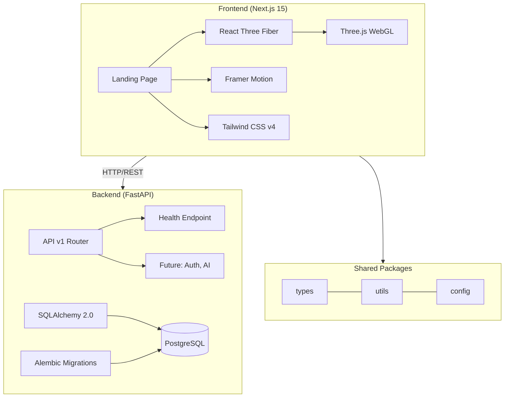

# InterviewOS — Architecture Guide

## System Overview

InterviewOS follows a **polyglot monorepo** architecture with clear separation between frontend (TypeScript/Node.js) and backend (Python) ecosystems, connected via Docker Compose for orchestration.



## Key Architecture Decisions

### 1. Why SQLAlchemy instead of Prisma?

The Prisma Python client has been deprecated. SQLAlchemy 2.0 with async support (asyncpg) is the current gold standard for Python ORMs. It provides:

- Native async/await support
- Excellent type safety with `mapped_column`
- Battle-tested Alembic migrations
- Active maintenance and massive community

### 2. Why Tailwind CSS v4?

Next.js 15 ships with Tailwind v4, which introduces:

- CSS-first configuration via `@theme` directive (no `tailwind.config.ts`)
- Faster build times
- Simplified syntax

### 3. Performance Strategy

The Three.js scenes use a **tiered performance system**:

| Tier | DPR | Particles | Post-Processing |
|------|-----|-----------|-----------------|
| High | 2.0 | 200 | Yes |
| Medium | 1.5 | 100 | No |
| Low | 1.0 | 50 | No |

The `PerformanceManager` component monitors FPS in real-time and automatically downgrades the tier if sustained low FPS is detected.

### 4. Animation Philosophy

- **Framer Motion** for all UI animations (scroll reveals, hover effects, transitions)
- **useFrame** in R3F for 3D scene animations
- **CSS keyframes** for simple, perpetual animations (aurora, glow, scroll)
- **GSAP** reserved for complex timeline sequences (not used in landing page)
- All animations respect `prefers-reduced-motion`

### 5. Component Architecture

```
components/
├── ui/          # Reusable design system components
│   ├── button.tsx
│   ├── cards.tsx
│   ├── section.tsx
│   └── icons.tsx
├── three/       # Reusable Three.js components
│   ├── ai-core.tsx
│   ├── environment.tsx
│   ├── scene-utils.tsx
│   ├── hero-scene.tsx
│   └── hero-scene-inner.tsx
└── landing/     # Landing page sections
    ├── navbar.tsx
    ├── hero-section.tsx
    ├── features-section.tsx
    ├── why-section.tsx
    ├── testimonials-section.tsx
    ├── stats-section.tsx
    └── footer.tsx
```

### 6. State Management

| Library | Purpose |
|---------|---------|
| Zustand | Client-side UI state (performance tier, menu state) |
| TanStack Query | Server state (API data caching, refetching) |
| React state | Component-local state |

### 7. Backend Structure

The backend follows a **layered architecture**:

```
app/
├── api/         # HTTP layer (routers, endpoints)
├── core/        # Configuration, logging, security
├── db/          # Database engine, session management
├── models/      # SQLAlchemy ORM models
└── schemas/     # Pydantic validation schemas
```

## Future Architecture

As InterviewOS scales, the architecture will expand to include:

- **Redis** for caching and session storage
- **Kafka** for event-driven processing
- **OpenAI/Gemini** for AI interview simulation
- **AWS S3** for file storage (resumes, recordings)
- **WebSocket** for real-time interview sessions
