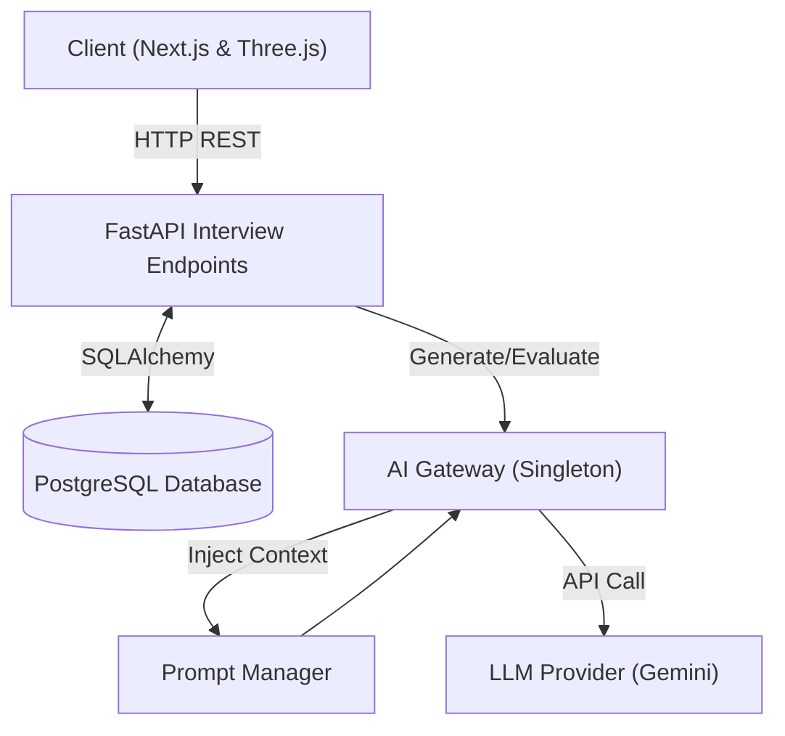
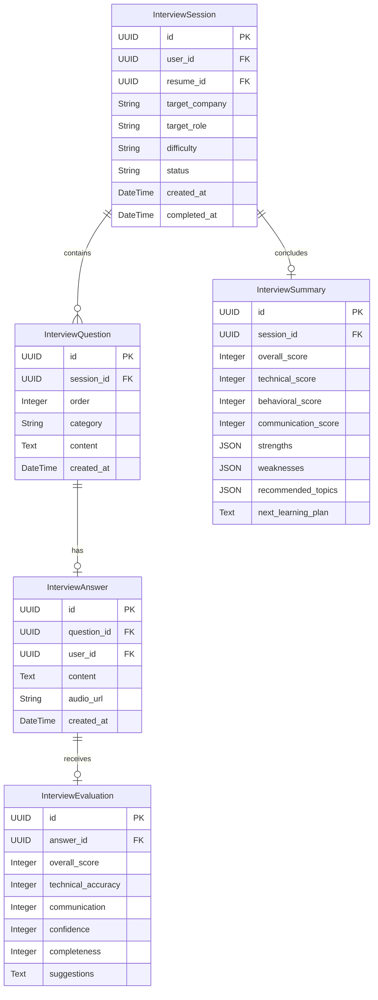
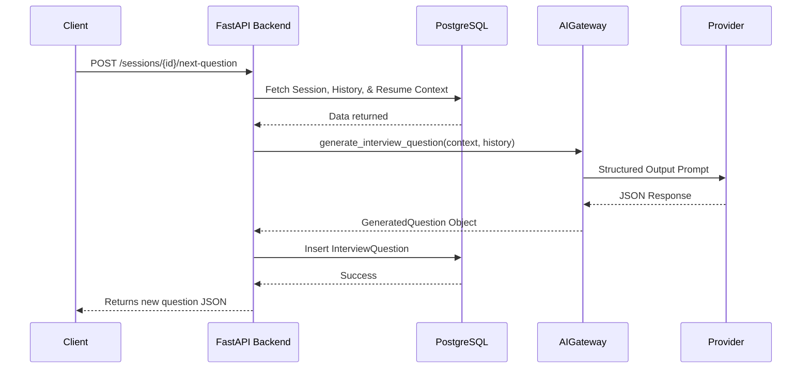
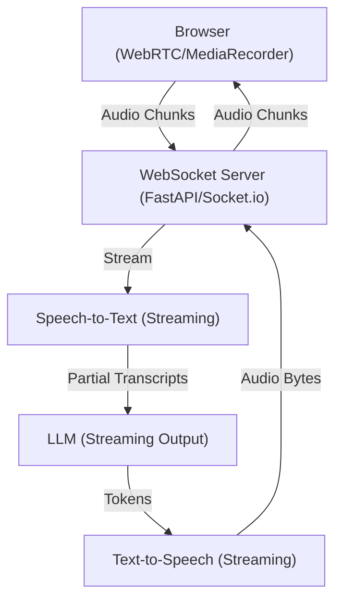

# InterviewOS - AI Interview Engine Documentation

## 1. Interview Engine Architecture

The AI Interview Engine is built on a scalable, stateful pipeline that leverages Next.js on the frontend and FastAPI on the backend. The core AI logic operates via a unified `AIGateway`, ensuring abstraction from direct LLM provider calls.



## 2. Database Schema

The Interview Engine introduces 5 primary normalized tables to track the entire state of an interview.



## 3. API Documentation

All endpoints are rate-limited and secured via `CurrentUser` dependencies.

| Endpoint | Method | Rate Limit | Purpose |
|----------|--------|------------|---------|
| `/api/v1/interview/start` | POST | 10/min | Initializes a new `InterviewSession`. Payload: `resume_id`, `target_role`, `target_company`, `difficulty`, `interview_type`, `duration_minutes`. |
| `/api/v1/interview/sessions/{session_id}/next-question` | POST | 20/min | Compiles resume context and interview transcript history to generate a contextually-aware next question via AI Gateway. |
| `/api/v1/interview/answer` | POST | 20/min | Submits candidate answer to a specific question, persists to DB, and requests AI evaluation of the answer. Payload: `session_id`, `question_id`, `content`. |
| `/api/v1/interview/end` | POST | 10/min | Marks the session as completed and compiles the entire transcript to generate the `InterviewSummary`. |
| `/api/v1/interview/history` | GET | 30/min | Retrieves all past sessions for the authenticated user. |
| `/api/v1/interview/{session_id}` | GET | 60/min | Fetches specific session details and its associated questions/answers. |
| `/api/v1/interview/summary/{session_id}` | GET | 30/min | Fetches the comprehensive final feedback report for a completed session. |

## 4. Sequence Diagram: Dynamic Questioning



## 5. Folder Structure

Relevant components for the Interview Engine:

```text
InterviewOS/
├── apps/
│   ├── backend/
│   │   ├── app/
│   │   │   ├── api/v1/endpoints/
│   │   │   │   └── interview.py       # Interview Engine REST Controllers
│   │   │   ├── models/
│   │   │   │   └── interview_engine.py # SQLAlchemy ORM Models
│   │   │   └── services/ai/
│   │   │       ├── gateway.py         # Unified AI abstraction layer
│   │   │       ├── schemas.py         # Pydantic structured output models
│   │   │       └── prompts/
│   │   │           └── interview/     # Plaintext prompt templates
│   ├── frontend/
│   │   └── src/
│   │       ├── app/(dashboard)/
│   │       │   └── interview/         # Interview configuration & UI pages
│   │       └── components/
│   │           └── interview/         # Video, transcript, and evaluation components
```

## 6. Future Voice Architecture

The current engine utilizes standard HTTP REST for turn-based text/audio communication. To achieve true real-time, low-latency conversational AI (simulating a human perfectly), the architecture will evolve to a **Streaming Voice Architecture**.



### Key Upgrades Required:
1. **WebSocket Integration:** Transition from polling REST APIs to persistent duplex WebSockets.
2. **Streaming AI Gateway:** Update `AIGateway` to yield tokens progressively (`async for chunk in response`) rather than waiting for full JSON generation.
3. **Interrupt Handling:** Add VAD (Voice Activity Detection) on the frontend to detect when the user speaks, sending a "cancel" interrupt to the WSS to abruptly stop the TTS generation.
